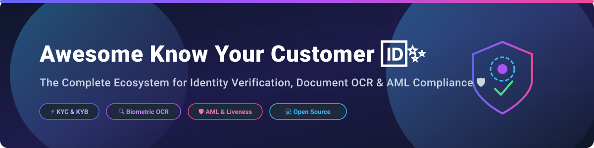

  

  
  
  
  

# 🆔 Awesome Know Your Customer (KYC) Tools & Open-Source Projects 🚀

> A curated, developer-first list of top **SaaS platforms** and **open-source GitHub repositories** for **Know Your Customer (KYC)**, **Identity Verification (IDV)**, **Anti-Money Laundering (AML) compliance**, **Document OCR**, and **Biometric Liveness Detection** 🛡️.

---

## 📊 Executive Summary & Market Insights

> 💡 **Market Size & Structure**: The global Identity Verification (KYC/IDV) market is estimated at **$11.8 Billion in 2025** and is projected to reach **$24.5 Billion by 2030** (CAGR ~15.7%). The sector is **moderately fragmented**, featuring established enterprise leaders (e.g., Stripe, Plaid, Persona, Trulioo, Jumio) competing alongside specialized biometric and privacy-focused open-source frameworks.

---

## 📌 Table of Contents

- [🏢 SaaS & Hosted KYC Platforms](#-saas--hosted-kyc-platforms)
- [🔓 Open-Source GitHub Projects](#-open-source-github-projects)
- [🧩 Core Open-Source Building Blocks](#-core-open-source-building-blocks)
- [🤝 How to Contribute](#-how-to-contribute)
- [☕ Support & Sponsorship](#-support--sponsorship)
- [📈 Star History](#-star-history)
- [⚠️ Disclaimer](#%EF%B8%8F-disclaimer)

---

## 🏢 SaaS & Hosted KYC Platforms

Below is a comparative breakdown of top identity verification vendors, sorted by company size (valuation / revenue descending) 📈.

| Vendor | Company Size (Valuation / Revenue) | Starting Pricing | Free Tier / Free Trial Limits | Key Features & Focus |
| :--- | :--- | :--- | :--- | :--- |
| 💳 **[Stripe Identity](https://stripe.com/identity)** | **$159 Billion Valuation** ($1B+ Revenue suite) | **$1.50** per verification (+$0.50 per SSN lookup) | **50 free verifications** (one-time developer allowance) | Native identity verification within Stripe ecosystem; government ID validation and face matching. |
| 🏦 **[Plaid Identity](https://plaid.com/identity/)** | **$8.0 Billion Valuation** ($546M ARR) | **$1.00 – $2.00** per check (Growth/Scale plan rates) | **10 free items** (Test plan with production data) + Unlimited Sandbox | Financial identity verification, bank account ownership, and instant identity validation. |
| 👤 **[Persona](https://withpersona.com/)** | **$2.0 Billion Valuation** ($100M+ ARR) | **$250/month** (Essential Plan) / **$0/mo** (Starter) | **500 free verifications/month** (Starter tier) + 60-day Sandbox | Highly customizable identity infrastructure for KYC/KYB/AML workflows with global coverage. |
| 🌐 **[Trulioo](https://www.trulioo.com/)** | **$1.8 Billion Valuation** (~$150M Revenue) | Custom quote based on volume | Custom trial via Sales demo | Global business and identity verification covering 195+ countries with real-time watchlist checks. |
| 👁️ **[Veriff](https://www.veriff.com/)** | **$1.5 Billion Valuation** (~$63M Revenue) | **$1.49 – $1.99** per verification (Self-serve) | **15-day free trial** on Premium plan | AI-driven identity verification with active liveness detection and fraud prevention. |
| 🛡️ **[Jumio](https://www.jumio.com/)** | **$250M+ Revenue** (Acquired / Private) | Custom enterprise agreement | Custom trial via Sales demo | End-to-end identity verification, biometric face matching, and automated AML risk orchestration. |
| 🔍 **[Onfido](https://onfido.com/)** | **$100M+ Revenue** (Acquired by Entrust) | Custom volume commitment | Custom trial via Sales demo | Document and facial biometrics verification tailored for regulated financial industries. |
| 🇪🇺 **[IDnow](https://www.idnow.io/)** | **$86M Revenue** (Acquired by Corsair Capital) | Custom enterprise plan | Custom trial via Sales demo | European video-based and automated AI KYC compliance platform for DACH and EU regulations. |
| 🔬 **[AU10TIX](https://www.au10tix.com/)** | **$260M Valuation** (~$50M–$100M Revenue) | Custom volume pricing (~$1.00/check baseline) | Demo environment upon request | Forensic document inspection, anti-spoofing, and automated serial fraud detection. |
| ⚖️ **[Sumsub](https://sumsub.com/)** | **$120M Valuation** (~$85M–$100M ARR) | **$1.35** per check ($149/mo minimum) | **14-day free trial** (Includes **50 free verifications**) | All-in-one verification platform for KYC, KYB, AML, and crypto transaction monitoring. |
| ⚡ **[Shufti Pro](https://shuftipro.com/)** | **$80M Valuation** (~$20M Revenue) | **$1.00** per verification (Pay-as-you-go) | **Free Forever Tier**: **10 free verifications/month** | Global identity checks supporting 10,000+ document types across 150+ languages. |
| 📦 **[ComplyCube](https://www.complycube.com/)** | **~$3M Revenue** (Venture Backed) | **$1.20** per check ($99/mo starting commitment) | **14-day free trial** with starter verification credits | User-friendly identity verification and AML compliance platform for startups and SMEs. |

---

## 🔓 Open-Source GitHub Projects

Explore top open-source identity verification frameworks, self-hosted KYC servers, and Zero-Knowledge (ZK) identity tools. Sorted by GitHub Stars_Count (descending) ⭐.

- **[PaddleOCR](https://github.com/paddlepaddle/PaddleOCR)**   
  🔤 Multilingual OCR toolkit supporting 80+ languages for extracting text from ID cards, passports, and driver's licenses.

- **[Tesseract OCR](https://github.com/tesseract-ocr/tesseract)**   
  📄 Industry-standard open-source OCR engine widely used for document parsing and PII extraction in custom KYC pipelines.

- **[MediaPipe](https://github.com/google-ai-edge/mediapipe)**   
  🎯 Cross-platform ML framework for real-time face landmark tracking, eye-blink detection, and head-pose liveness verification.

- **[face_recognition](https://github.com/ageitgey/face_recognition)**   
  📸 Simple facial recognition API built on dlib with 99.38% accuracy for matching selfies to ID photos.

- **[EasyOCR](https://github.com/JaidedAI/EasyOCR)**   
  📝 Ready-to-use optical character recognition library supporting 80+ languages for identity document processing.

- **[InsightFace](https://github.com/deepinsight/insightface)**   
  🧬 State-of-the-art 2D/3D deep face analysis repository providing ArcFace face recognition and liveness analysis models.

- **[DeepFace](https://github.com/serengil/deepface)**   
  🤖 Lightweight face recognition and facial attribute analysis framework wrapping VGG-Face, ArcFace, and Facenet.

- **[face-api.js](https://github.com/justadudewhohacks/face-api.js)**   
  🌐 JavaScript API for browser-based face detection and facial landmark verification using TensorFlow.js.

- **[pytesseract](https://github.com/madmaze/pytesseract)**   
  🐍 Python wrapper for Google's Tesseract OCR engine, ideal for extracting text from cropped identity documents.

- **[Ballerine](https://github.com/ballerine-io/ballerine)**   
  ⚙️ Open-source infrastructure for identity and risk management. Features KYC/KYB UI flows, rule engine, and vendor orchestration.

- **[Hyperledger Indy Node](https://github.com/hyperledger/indy-node)**   
  🔗 Decentralized identity ledger server designed specifically for self-sovereign identity (SSI) and verifiable credentials.

- **[uPort Connect](https://github.com/uport-project/uport-connect)**   
  🔑 Client library for decentralized identity verification on Ethereum for Web3 apps.

- **[graph-vl](https://github.com/verifid/graph-vl)**   
  🕸️ Self-hosted GraphQL identity verification layer for managing customer identity verification workflows.

- **[AegisKYC](https://github.com/ishansurdi/AegisKYC)**   
  🛡️ AI-powered KYC automation platform featuring adaptive risk scoring, biometrics, OCR, and deepfake detection.

- **[Ethereum Identity Verification](https://github.com/Cryptonomica/Ethereum-IdentityVerification)**   
  ⛓️ Identity verification system linking real-world identity to Ethereum addresses with cryptographic keys.

- **[FaydaPass](https://github.com/CakeInTech/FaydaPass)**   
  🆔 Modern KYC web application integrating with national eSignet OIDC identity systems (Next.js & Supabase).

- **[biometrical-verify](https://github.com/asalazarvaldiviaocg/biometrical-verify)**   
  🔐 Self-hosted biometric verification with passive/active liveness, FFT deepfake detection, and signed verification receipts.

- **[AI-KYC-System](https://github.com/arpiitt/AI-KYC-System)**   
  🤖 Automated KYC pipeline built with FastAPI, React, OpenCV, face-recognition, and PyTesseract OCR.

---

## 🧩 Core Open-Source Building Blocks

When building custom, self-hosted KYC and identity verification architectures 🛠️:

- **OCR & Text Extraction**: Combine **PaddleOCR** or **Tesseract** for reading names, DOBs, and ID numbers 🔤.
- **Biometric Matching**: Use **DeepFace** or **InsightFace** to compute embeddings and match selfies with ID document photos 📸.
- **Liveness & Anti-Spoofing**: Implement **MediaPipe** for head movement tracking and landmark analysis 👁️.
- **Workflow & Case Management**: Deploy **Ballerine** for orchestrating verification flows and manual review dashboards ⚙️.

---

## 🤝 How to Contribute

1. 🍴 Fork this repository.
2. 📝 Edit `README.md` following the tabular format for SaaS products or badge style for Open-Source repositories.
3. 🚀 Submit a Pull Request with factual context and links to official resources.

---

## ☕ Support & Sponsorship

Thank you for visiting this repository! If you find this curated collection helpful for your fintech product, compliance research, or identity verification projects, please consider supporting the project:

- ⭐ **Star** this repository to show your appreciation!
- 🔀 **Fork** and share it with fellow developers and identity engineers.
- ☕ **Sponsor / Buy me a coffee**: Support ongoing open-source maintenance via [GitHub Sponsors](https://github.com/sponsors/ishandutta2007).

---

## 📈 Star History

---

## ⚠️ Disclaimer

- ℹ️ This list is community-curated for informational purposes.
- 🔒 KYC processes deal with Sensitive Personal Data (PII and biometrics). Implementers must ensure compliance with GDPR, CCPA, BSA/AML, and local regulatory requirements.

---

**Maintained with ❤️ for fintech founders, compliance officers, identity engineers, and open-source advocates.**
